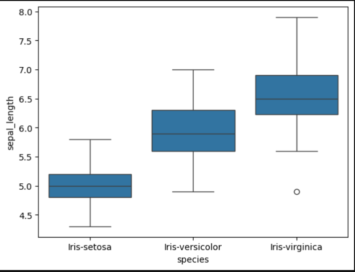
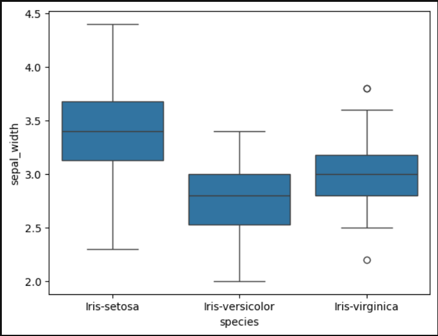
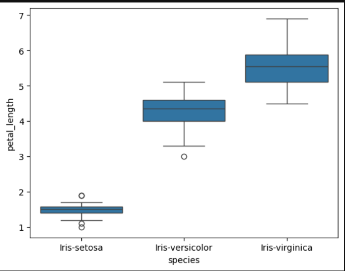
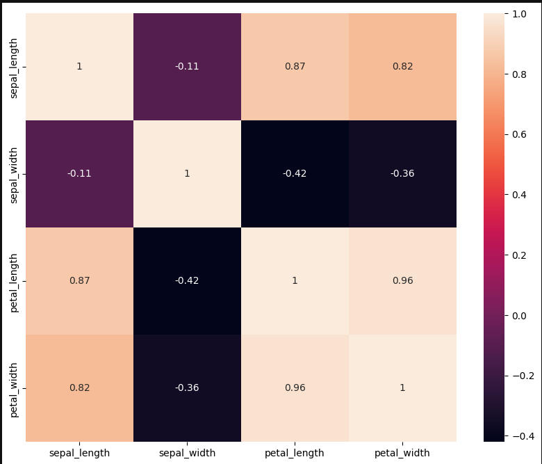
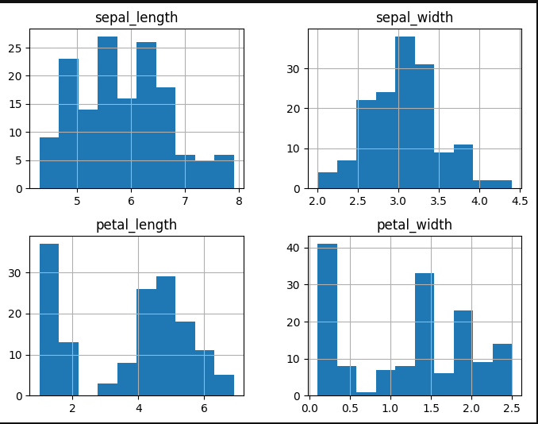
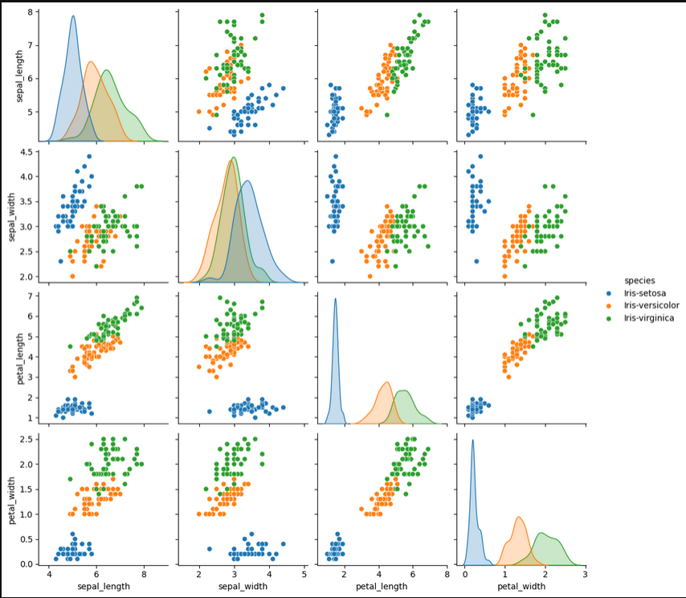
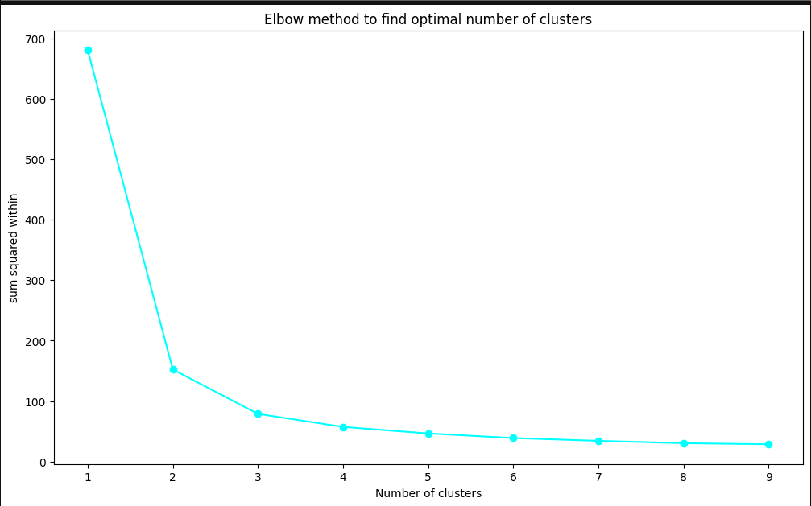
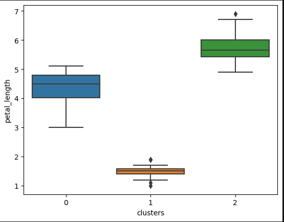
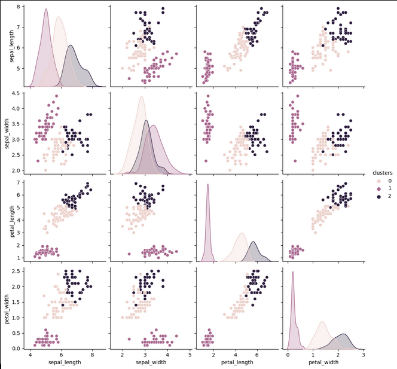

# Unsupervised Learning: A Technical Deep Dive

## Introduction to Unsupervised Learning
In the realm of machine learning, unsupervised learning occupies a crucial niche. Here, algorithms are tasked with exploring and extracting insights from unlabeled data, where no predetermined outputs guide the learning process. This autonomous exploration often leads to the discovery of hidden patterns, structures, and relationships within the data.

## Key Algorithms Explored

### Clustering Algorithms:
- **K-Means Clustering:** This classic algorithm partitions the dataset into 'k' clusters based on the Euclidean distance from centroid points. It converges iteratively to minimize the within-cluster sum of squares.
   
- **Hierarchical Clustering:** By building a dendrogram of data points, this method creates a tree of clusters. It allows for a visual representation of relationships and does not require a predefined number of clusters.
   
- **DBSCAN (Density-Based Spatial Clustering of Applications with Noise):** DBSCAN groups together points that are closely packed, defining clusters as dense regions separated by sparser areas.

### Dimensionality Reduction Techniques:
- **Principal Component Analysis (PCA):** A linear technique that transforms high-dimensional data into a lower-dimensional space. It achieves this by identifying orthogonal components that capture the maximum variance in the data.
   
- **t-Distributed Stochastic Neighbor Embedding (t-SNE):** Particularly useful for visualization, t-SNE preserves local structure in the data, revealing clusters and patterns that might be obscured in higher dimensions.
   
- **Autoencoders:** These neural network architectures learn to encode input data into a lower-dimensional representation, then reconstruct the original input. They are powerful tools for nonlinear dimensionality reduction.

### Association Rule Learning:
- **Apriori Algorithm:** Widely used in market basket analysis, the Apriori algorithm discovers frequent itemsets in transactional data. It identifies associations between items based on their co-occurrence in transactions.
   
- **FP-Growth (Frequent Pattern Growth):** An efficient algorithm for mining frequent patterns in large datasets. It constructs a compact data structure, the FP-tree, to discover frequent itemsets without generating candidate sets.

## Applications and Real-World Implementations

### Clustering Applications:
- **Market Segmentation:** Unsupervised learning techniques such as K-Means clustering are employed by businesses to segment customers based on purchasing behavior, demographics, or preferences.
   
- **Anomaly Detection:** DBSCAN and other clustering algorithms are used in cybersecurity to detect unusual patterns in network traffic, identifying potential threats or anomalies.
   
- **Social Network Analysis:** Hierarchical clustering and community detection algorithms help in understanding social network structures, identifying influential nodes or communities within networks.

### Dimensionality Reduction in Action:
- **Image and Speech Recognition:** PCA and t-SNE play crucial roles in reducing the dimensions of image and audio data, making it easier for machine learning models to classify and recognize patterns.
   
- **Collaborative Filtering:** Techniques like matrix factorization, a form of dimensionality reduction, are used in recommendation systems such as those employed by streaming services to suggest movies or songs based on user preferences.
   
- **Feature Extraction for Supervised Learning:** Autoencoders are used to extract meaningful features from raw data, which can then be fed into a supervised learning model for classification or regression tasks.

### Association Rule Learning in Practice:
- **Market Basket Analysis:** Retailers use association rule learning to discover relationships between products frequently purchased together. This insight informs product placement, promotions, and bundling strategies.
   
- **Recommender Systems:** Companies like Amazon and Netflix utilize association rules to recommend products or movies based on users' past behavior, enhancing user experience and engagement.
   
- **Cross-Selling Strategies:** By understanding item associations, businesses can optimize cross-selling efforts, suggesting complementary products to customers during purchase or engagement.

## Advantages and Challenges in Unsupervised Learning

### Advantages:
- **Label-Free Exploration:** Unsupervised learning liberates practitioners from the need for labeled data, allowing for more flexible and expansive analysis.
   
- **Uncovering Hidden Patterns:** These algorithms excel at discovering underlying structures in data that may not be immediately apparent, leading to novel insights and discoveries.
   
- **Exploratory Data Analysis:** Unsupervised methods are invaluable for the initial exploration of datasets, providing a foundation for more targeted investigations.

### Challenges:
- **Evaluation Complexity:** Without ground truth labels, evaluating the performance of unsupervised algorithms can be intricate and subjective.
   
- **Interpretability Issues:** Understanding and explaining the results of clustering or dimensionality reduction to stakeholders can be challenging, especially with complex models.
   
- **Sensitivity to Outliers:** Clustering algorithms, in particular, can be greatly affected by outliers or noisy data points, leading to skewed results.
   
- **Parameter Tuning:** Selecting the optimal number of clusters or the right dimensions for reduction requires careful consideration and domain expertise.

## Best Practices for Unsupervised Learning Success

1. **Robust Data Preprocessing:**
   - Thorough cleaning, scaling, and handling of missing data ensure the reliability of unsupervised learning outcomes.
   
2. **Visualization for Insight:**
   - Leveraging visualizations such as scatter plots, dendrograms, or 3D embeddings aids in understanding data distributions and model outputs.
   
3. **Hyperparameter Optimization:**
   - Iterative tuning of algorithmic parameters, such as cluster counts or learning rates, enhances model performance.
   
4. **Ensemble Techniques:**
   - Combining multiple unsupervised models or integrating them with supervised methods often results in improved predictive power and robustness.
   
5. **Domain Expertise Integration:**
   - Collaborating with domain experts ensures that the chosen algorithms align with the specific needs and nuances of the problem domain.

Unsupervised learning represents a frontier of exploration and discovery in the machine learning landscape. Its diverse algorithms, from clustering to dimensionality reduction to association rule learning, offer powerful tools for extracting valuable insights from unstructured data. Through careful application, practitioners can unveil hidden patterns, optimize business strategies, and drive innovation across a spectrum of industries and domains.

# PROGRAM

## Importing Important Libraries

import pandas as pd
from sklearn.cluster import KMeans
import matplotlib.pyplot as plt
import seaborn as sns
```

%matplotlib inline
```
## Importing important Packages and  Datasets

```python
# Importing the dataset

iris=pd.read_csv("iris.csv")
iris.columns
```
Index(['sepal_length', 'sepal_width', 'petal_length', 'petal_width',
       'species'],
      dtype='object')

iris.head()

sepal_length 	sepal_width 	petal_length 	petal_width 	species
0 	5.1 	3.5 	1.4 	0.2 	Iris-setosa
1 	4.9 	3.0 	1.4 	0.2 	Iris-setosa
2 	4.7 	3.2 	1.3 	0.2 	Iris-setosa
3 	4.6 	3.1 	1.5 	0.2 	Iris-setosa
4 	5.0 	3.6 	1.4 	0.2 	Iris-setosa

```python
iris.describe()
```

sepal_length 	sepal_width 	petal_length 	petal_width
count 	150.000000 	150.000000 	150.000000 	150.000000
mean 	5.843333 	3.054000 	3.758667 	1.198667
std 	0.828066 	0.433594 	1.764420 	0.763161
min 	4.300000 	2.000000 	1.000000 	0.100000
25% 	5.100000 	2.800000 	1.600000 	0.300000
50% 	5.800000 	3.000000 	4.350000 	1.300000
75% 	6.400000 	3.300000 	5.100000 	1.800000
max 	7.900000 	4.400000 	6.900000 	2.500000

```python
iris.info()
```
<class 'pandas.core.frame.DataFrame'>
RangeIndex: 150 entries, 0 to 149
Data columns (total 5 columns):
 #   Column        Non-Null Count  Dtype  
---  ------        --------------  -----  
 0   sepal_length  150 non-null    float64
 1   sepal_width   150 non-null    float64
 2   petal_length  150 non-null    float64
 3   petal_width   150 non-null    float64
 4   species       150 non-null    object 
dtypes: float64(4), object(1)
memory usage: 6.0+ KB

## Checking The Null values In the Dataset

```python
iris.isnull().sum()
```
sepal_length    0
sepal_width     0
petal_length    0
petal_width     0
species         0
dtype: int64

## Exploratory Data Analysis 

### Box Plots

```python
# This shows how comparision of sepal length for different species

sns.boxplot(x = 'species', y='sepal_length', data = iris)
```
<Axes: xlabel='species', ylabel='sepal_length'>


### This shows how comparision of sepal width for different species

```python
sns.boxplot(x = 'species', y='sepal_width', data = iris)
```

<Axes: xlabel='species', ylabel='sepal_width'>


### This shows how comparision of petal length for different species
```python
sns.boxplot(x = 'species', y='petal_length', data = iris)
```
<Axes: xlabel='species', ylabel='petal_length'>

###  This shows how comparision of petal width for different species
```python
sns.boxplot(x = 'species', y='petal_width', data = iris)
```
<Axes: xlabel='species', ylabel='petal_width'>

## Correlation plot
```python
figsize=[10,8]
plt.figure(figsize=figsize)
sns.heatmap(iris.corr(),annot=True)
plt.show()
```


** Strong positive correlation between **
sepal length -- petal length
sepal length -- petal width
petal length -- petal width 

## Histogram

### Shows distribution of the variables
```python
iris.hist(figsize=(8,6))
plt.show()
```

There is not much variance between the columns. We don't have to perform any scaling.

### Pair plot

```python
sns.pairplot(iris, hue='species')
```
<seaborn.axisgrid.PairGrid at 0x7ff8a9e2dee0>


** Setosa ** is easily separable using most of the columns.

** We will drop the 'species' column as it is object type which can't be used in clustering**
```python
iris.drop(['species'],axis = 1, inplace=True)
```
## 4. Finding Clusters with Elbow Method
```python
ssw=[]
cluster_range=range(1,10)
for i in cluster_range:
    model=KMeans(n_clusters=i,init="k-means++",n_init=10, max_iter=300, random_state=0)
    model.fit(iris)
    ssw.append(model.inertia_)
```
```python
ssw_df=pd.DataFrame({"no. of clusters":cluster_range,"SSW":ssw})
print(ssw_df)
```
no. of clusters         SSW
0                1  680.824400
1                2  152.368706
2                3   78.940841
3                4   57.345409
4                5   46.535582
5                6   38.938740
6                7   34.299986
7                8   30.411659
8                9   28.643905

```python
plt.figure(figsize=(12,7))
plt.plot(cluster_range, ssw, marker = "o",color="cyan")
plt.xlabel("Number of clusters")
plt.ylabel("sum squared within")
plt.title("Elbow method to find optimal number of clusters")
plt.show()
```


** Please notice that we spotted the elbow when number of clusters is 3 and after 3rd cluster there is no significant change in ssw. **

## 5. Building K Means model
```python
# We'll continue our analysis with n_clusters=3
kmeans=KMeans(n_clusters=3, init="k-means++", n_init=10, random_state = 42)
# Fit the model
k_model=kmeans.fit(iris)
```
```python
## It returns the cluster vectors i.e. showing observations belonging which clusters 
clusters=k_model.labels_
clusters
```
array([1, 1, 1, 1, 1, 1, 1, 1, 1, 1, 1, 1, 1, 1, 1, 1, 1, 1, 1, 1, 1, 1,
       1, 1, 1, 1, 1, 1, 1, 1, 1, 1, 1, 1, 1, 1, 1, 1, 1, 1, 1, 1, 1, 1,
       1, 1, 1, 1, 1, 1, 2, 0, 2, 0, 0, 0, 0, 0, 0, 0, 0, 0, 0, 0, 0, 0,
       0, 0, 0, 0, 0, 0, 0, 0, 0, 0, 0, 2, 0, 0, 0, 0, 0, 0, 0, 0, 0, 0,
       0, 0, 0, 0, 0, 0, 0, 0, 0, 0, 0, 0, 2, 0, 2, 2, 2, 2, 0, 2, 2, 2,
       2, 2, 2, 0, 0, 2, 2, 2, 2, 0, 2, 0, 2, 0, 2, 2, 0, 0, 2, 2, 2, 2,
       2, 0, 2, 2, 2, 2, 0, 2, 2, 2, 0, 2, 2, 2, 0, 2, 2, 0], dtype=int32)

 ```python
 iris=pd.read_csv("iris.csv")     
```
** So the observations belongs to 3 clusters **
This is very similar to the 3 species which the flowers belong to.

```python
iris['clusters']=clusters
print(iris.head())
print(iris.tail())
```

   sepal_length  sepal_width  petal_length  petal_width      species  clusters
0           5.1          3.5           1.4          0.2  Iris-setosa         1
1           4.9          3.0           1.4          0.2  Iris-setosa         1
2           4.7          3.2           1.3          0.2  Iris-setosa         1
3           4.6          3.1           1.5          0.2  Iris-setosa         1
4           5.0          3.6           1.4          0.2  Iris-setosa         1
     sepal_length  sepal_width  petal_length  petal_width         species  \
145           6.7          3.0           5.2          2.3  Iris-virginica   
146           6.3          2.5           5.0          1.9  Iris-virginica   
147           6.5          3.0           5.2          2.0  Iris-virginica   
148           6.2          3.4           5.4          2.3  Iris-virginica   
149           5.9          3.0           5.1          1.8  Iris-virginica   

     clusters  
145         2  
146         0  
147         2  
148         2  
149         0  

Cluster 0 -- versicolor
Cluster 1 -- Setosa
Cluster 2 -- Virginica 

```python
sns.boxplot(x = 'clusters', y='petal_width', data = iris)
```
<Axes: xlabel='clusters', ylabel='petal_width'>


```python
sns.boxplot(x = 'clusters', y='petal_length', data = iris)
```
<Axes: xlabel='clusters', ylabel='petal_length'>



### Size of each cluster

```python
iris['clusters'].value_counts()
```
0    62
1    50
2    38
Name: clusters, dtype: int64

### Centroid of each clusters

```python
centroid_df = pd.DataFrame(k_model.cluster_centers_, columns=['sepal_length', 'sepal_width', 'petal_length', 'petal_width'])
centroid_df
```
 	sepal_length 	sepal_width 	petal_length 	petal_width
0 	5.901613 	2.748387 	4.393548 	1.433871
1 	5.006000 	3.418000 	1.464000 	0.244000
2 	6.850000 	3.073684 	5.742105 	2.071053

### Visualizing the cluster based on each pair of columns

```python
sns.pairplot(iris, hue='clusters')
```

<seaborn.axisgrid.PairGrid at 0x1ef3d44e500>





# ```The End```


